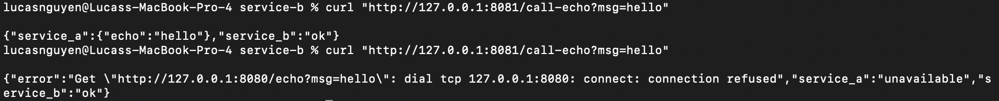

# CMPE 273 – Week 1 Lab 1: Your First Distributed System (Starter)

This starter provides two implementation tracks:
- `python-http/` (Flask + requests)
- `go-http/` (net/http)

Pick **one** track for Week 1.

## Lab Goal
Build **two services** that communicate over the network:
- **Service A** (port 8080): `/health`, `/echo?msg=...`
- **Service B** (port 8081): `/health`, `/call-echo?msg=...` calls Service A

Minimum requirements:
- Two independent processes
- HTTP (or gRPC if you choose stretch)
- Basic logging per request (service name, endpoint, status, latency)
- Timeout handling in Service B
- Demonstrate independent failure (stop A; B returns 503 and logs error)

## Deliverables
1. Repo link
2. README updates:
   - how to run locally
   - success + failure proof (curl output or screenshot)
   - 1 short paragraph: “What makes this distributed?”

## How to run locally
- Ensure you have Go installed
- Need to have 2 terminals open
- Both terminals:
  - cd cmpe273-week1-lab1-starter
  - cd go-http
- Terminal 1:
  - cd service-a
  - go mod init service-a
  - go run .
- Terminal 2:
  - cd service-b
  - go mod init service-b
  - go run .

## Screenshots

## Why is this distributed?
Both the services are isolated and run independently on the same machine on the same network. If one service fails, it does not affect both services. There is proper error handling for such a scenario and the other service continues to run properly.