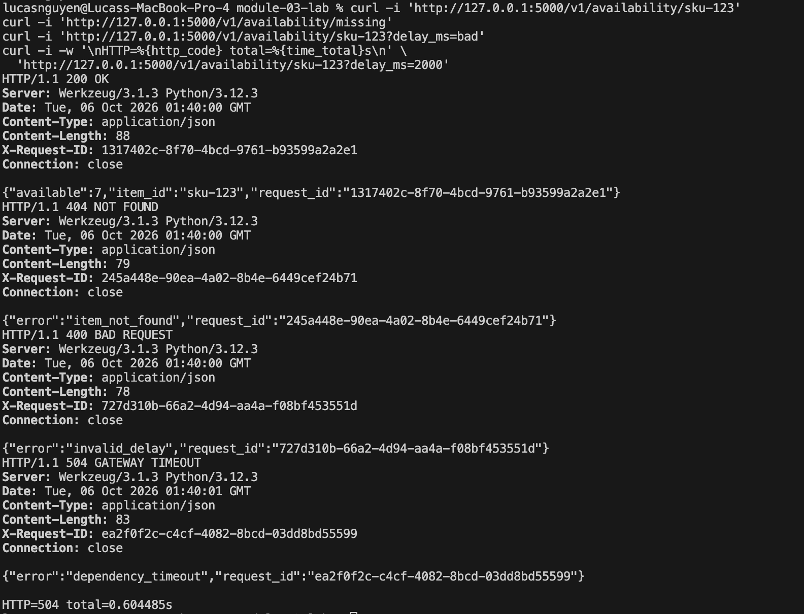
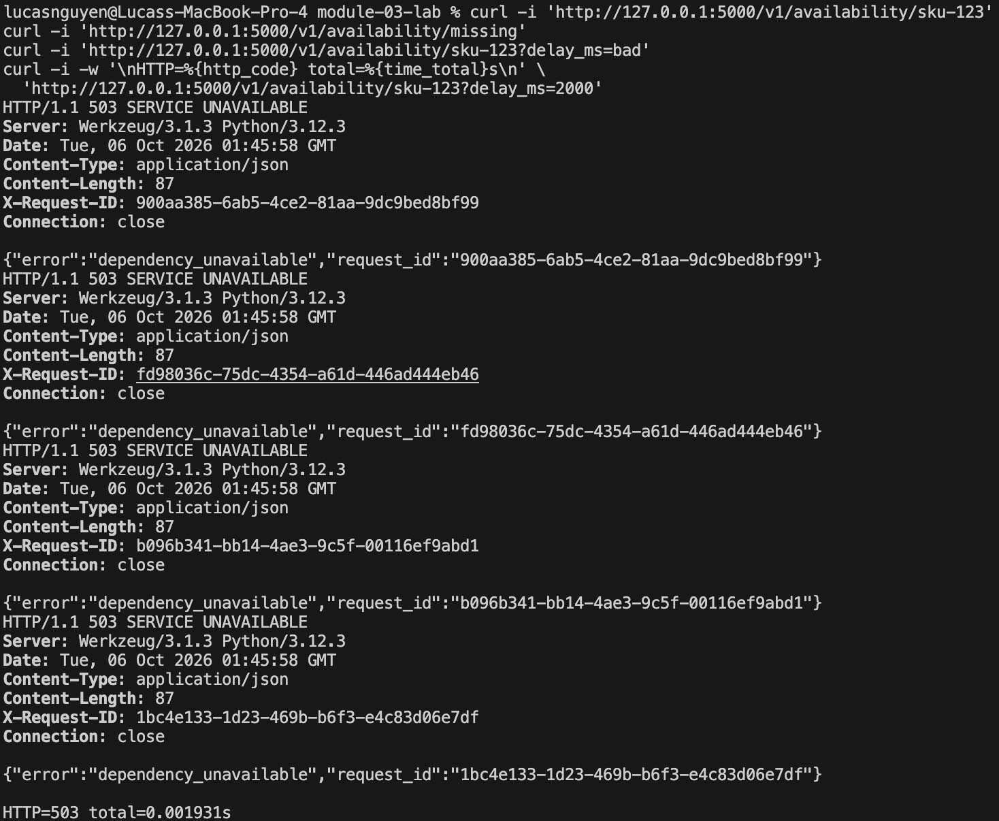
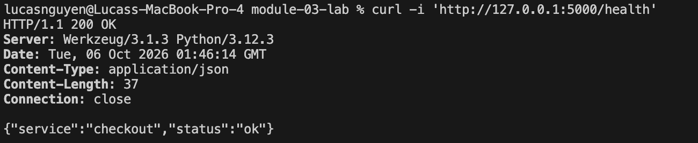
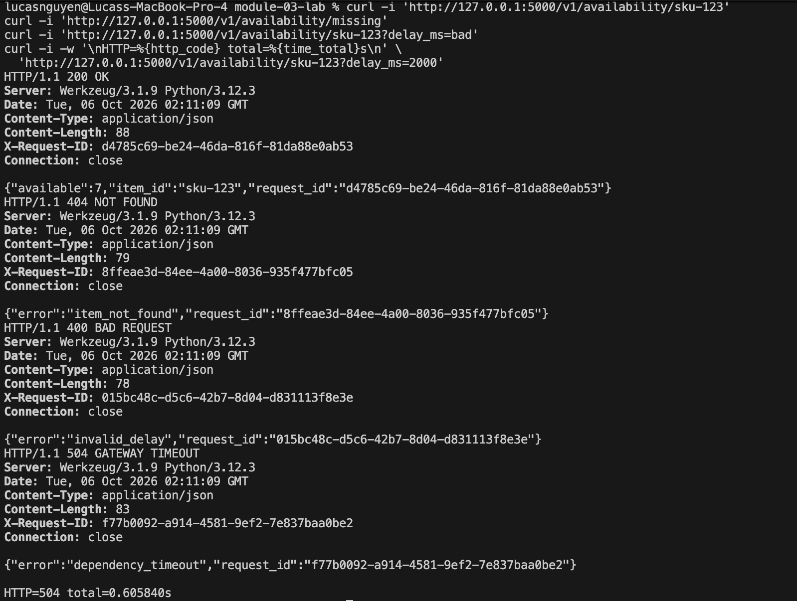
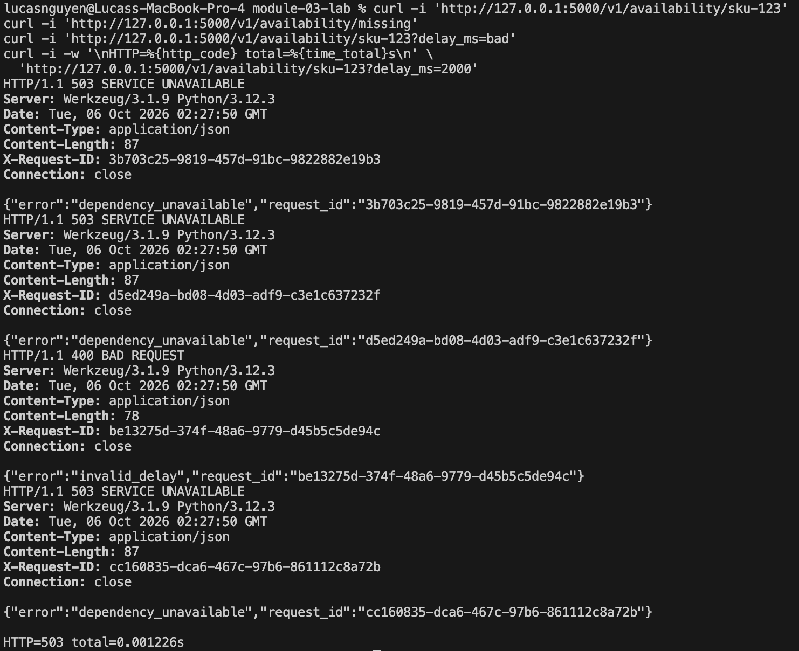
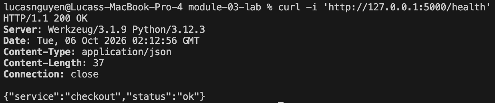

# REST 
## Run Instructions
### checkout.py
```bash
cd REST
python -m venv .venv
source .venv/bin/activate
pip install -r requirements.txt
python checkout.py
```

### inventory.py (new terminal)
```bash
cd REST
python -m venv .venv
source .venv/bin/activate
pip install -r requirements.txt
python inventory.py
```

## Examples
### Healthy curls


### Inventory down


### Checkout health


# gRPC
## Setup & Run Instructions
### Setup
```bash
cd gRPC
python3 -m venv .venv
source .venv/bin/activate
python -m pip install -r requirements.txt
python -m grpc_tools.protoc -I. --python_out=. --grpc_python_out=. inventory.proto
```

### checkout.py
```bash
cd gRPC
source .venv/bin/activate
python checkout.py
```

### inventory.py (new terminal)
```bash
cd gRPC
source .venv/bin/activate
python inventory.py
```

## Examples
### Healthy curls


### Inventory down


### Checkout health


# Comparison - REST vs gRPC
## Rest
- checkout sends an HTTP request to a URL, inventory returns JSON
- Have to write request and response handling
- 200ms connection timeout & 600ms read timeout, inventory keeps sleeping after checkout times out
- Communicates errors through HTTP status codes and JSON bodies
- Requires directly writing routes and HTTP calls

## gRPC
- checkout calls a method defined in a .proto file
- Generated Python code handles sending and receiving structured messages
- 600ms deadline for entire gRPC, inventory listens for cancellation and stops its simulated delay
- Communicates errors through RPC status codes and details(checkout translates back to HTTP responses)
- .proto file generates message classes and service interfaces, then implement the server and use the generated client stub
- Both services have a shared, explicit contract, but require extra tooling